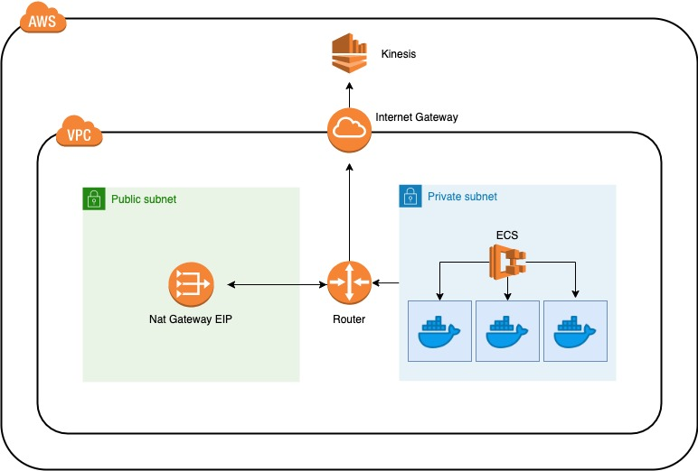

# terraform-ecs-kinesis 

In this project, we're running KCL (kinesis client library) within Docker on ECS.

The infrastructure contains both private and public subnets within a VPC.

## Looking at the diagram above

Our ECS service is contained within our private subnet and communicates with the internet via a route table attachment to a Nat Gateway living in our public subnet.

The public subnet then has another route table attachment that connects outbound requests to our Internet Gateway.

This gives our container consumers access to poll for messages from our Kinesis instance.

## KCL

Our KCL consumers run on top of the JVM (KCL dependency).

Essentially, the KCL node library spawns a child process which executes the KCL java library code which handles the polling + backpressuring + checkpointing code (aka all of the hard stuff). The configuration for KCL can be found in our [kinesis.properties](./kinesis.properties) file.

With the help of KCL, we are able to run `n` number of nodes on ECS and KCL will handle distributing stream traffic amongst the different nodes.

## Docker

To use KCL, we install Java + Node on a ubuntu image in our Dockerfile. This is obviously important since KCL utilizes Java code under the hood.

## Producing messages

In our producer file, we are putting messages on our `test` stream which uses a UUID for the message's partition key.

If we were to use the same partition key for every message (say `hello` for example), the Kinesis paritition hash would be the same for every message resulting in every message being dropped onto the same stream.

This may be beneficial in some cases, but in our case we want message traffic to be distributed across our `3 shards`.

## Consuming messages

Our consumer code is relatively simple. We are listening for messages, shoving them into an internal async queue, and processing them one by one up to our `DEFAULT_CONCURRENCY_LIMIT`.

For every message we get, we insert an item into DynamoDB.

Once the message is finished processing, we commit the sequence number which tells Kinesis to continue processing.